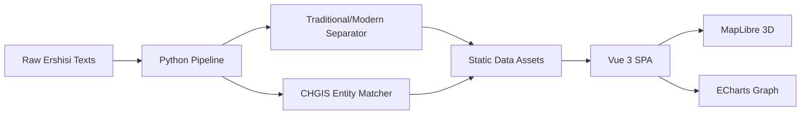

# 🌌 无限时空图谱 (Infinite SpatioTemporal Map)
> **“究天人之际，通古今之变，成一家之言” —— 数字时代的历史叙事引擎。**


## 🏛️ 项目愿景
**“无限时空图谱”** 是一个旨在通过高精度知识工程，将中国核心史料——**《二十四史》**与权威地理信息系统 **CHGIS** 深度融合的开源项目。我们不仅在复刻历史，更是在构建一个可交互、可降维打击传统史学研究方式的数字孪生时空。

---

## 💎 核心价值支柱

### 1. 史料级数字化资产 (The 24 Histories Dataset)
我们完成了对 467 卷《二十四史》的全量数字化重构，实现了前所未有的**繁简对照、文白联动**。

*   **全量覆盖**：从《史记》到《明史》，无缝切换。
*   **文白对照**：每一章节均配有精准提取的现代白话译文。

### 2. CHGIS 权威时空底座 (Spatial Accuracy)
通过集成哈佛大学/复旦大学联合发布的 **CHGIS v6** 数据库，我们锁定了 5224 个历史行政节点。

*   **时间变迁**：动态展示从西汉到明清的地名沿革。
*   **3D 地形**：基于实测高程数据的 3D 数字沙盘。

### 3. 知识图谱星云 (Knowledge Nebula)
基于地毯式实体挖掘算法，构建了数十万个历史人物、地名、职官的关联网络。

*   **实体回溯**：点击图谱节点，瞬间定位至《二十四史》原始出处。
*   **血缘与从属**：自动推演历史人物间的复杂社交网络。

---

## 🛠️ 四大核心功能模块

| 模块 | 视觉展示 | 核心特点 |
| :--- | :--- | :--- |
| **3D 时空沙盘** |  | 4K 级地形渲染，历史轨迹动态呼吸动画。 |
| **学术阅读器** |  | 简繁文白三分屏对照，实体点击高亮追踪。 |
| **地铁时间轴** |  | 线性时间美学，瞬间穿越三千年历史长河。 |
| **实名百科** |  | 每一个条目均有史料支撑，拒绝伪造数据。 |

---

## ⚡ 技术炼金术
本项目采用 **Data-First** 架构，无需后端，克隆即用。


### 技术栈生态




---

## 📦 快速开始
```bash
# 克隆这个数字文明
git clone https://github.com/yuanbw2025/Infinite_SpatioTemporal_Map.git

# 安装依赖
npm install

# 开启时空之门
npm run dev
```

---
**由学术执念驱动，为历史传承而生。**
