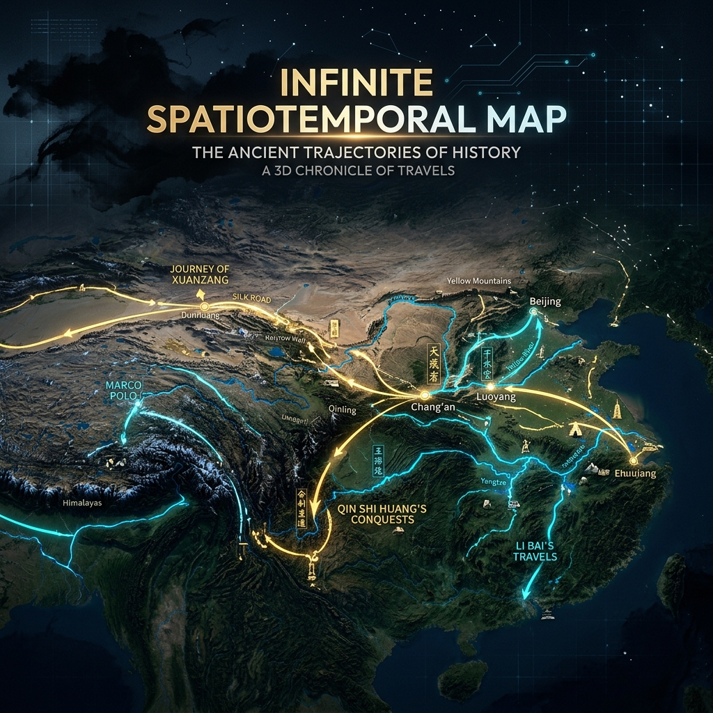
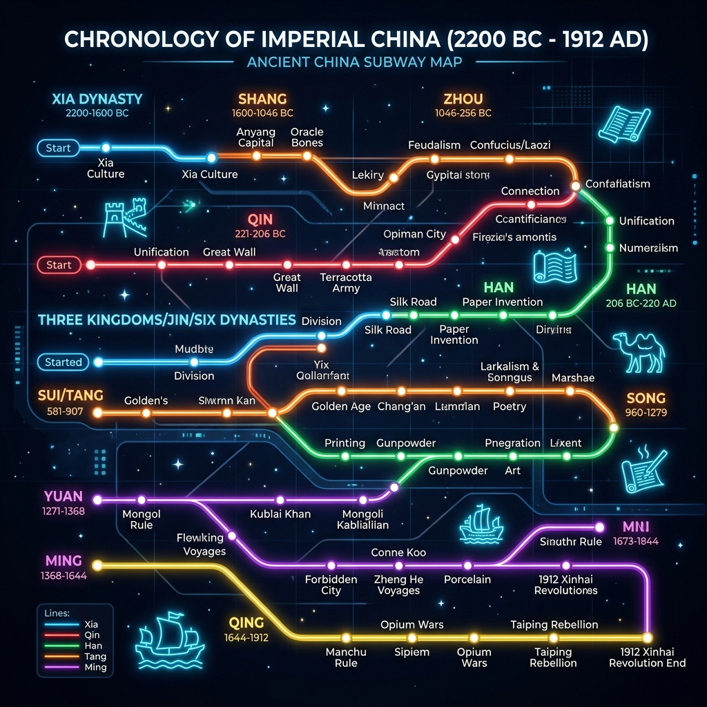
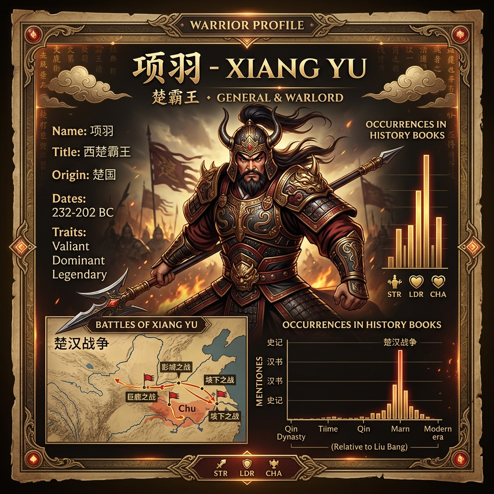
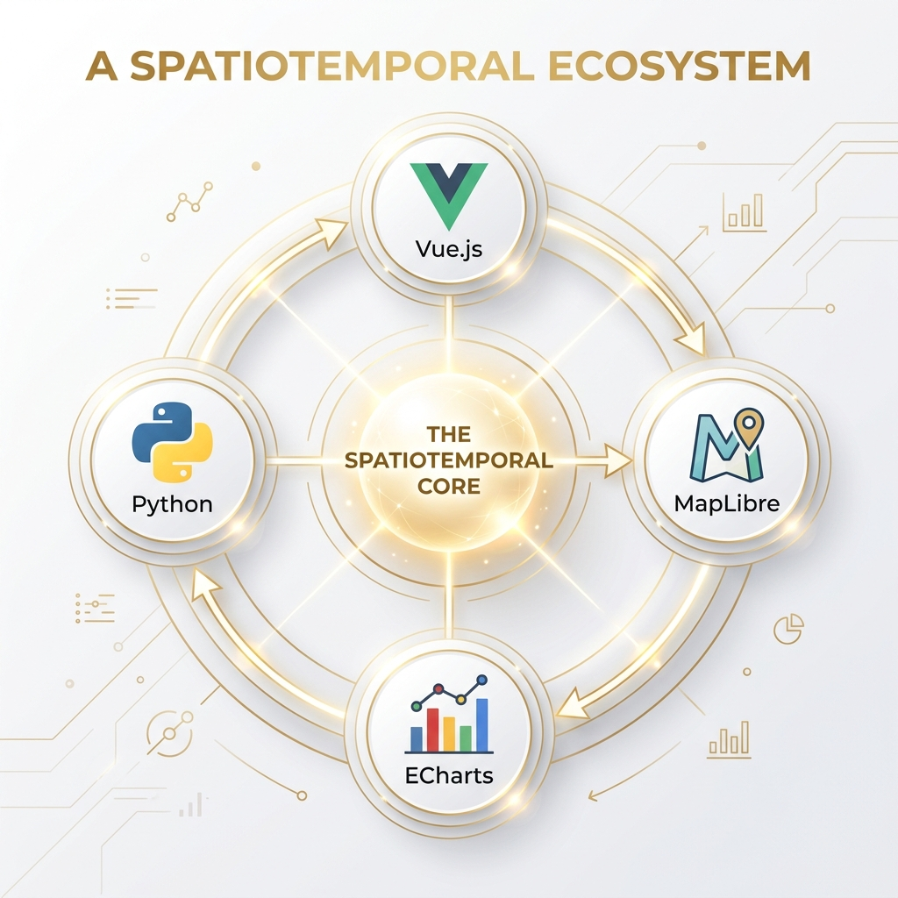

# 🌌 无限时空图谱 (Infinite SpatioTemporal Map)

> **"究天人之际，通古今之变，成一家之言" —— 数字时代的历史叙事引擎。**



## 🏛️ 项目愿景

**无限时空图谱** 是一个面向中国古代正史的高精度知识工程开源项目。将《二十四史》467 卷原文与哈佛/复旦 **CHGIS v6** 权威地理数据深度融合，通过 3D 交互沙盘、学术阅读器、知识图谱等多维度呈现历史知识。

**Data-First 架构**：仓库内包含所有已处理数据，`git clone` 后无需后端、无需 API Key，浏览器直接使用。

---

## 💎 核心价值

### 1. 史料级数字化资产

467 卷《二十四史》全量数字化，繁简对照、文白联动。


### 2. CHGIS 权威时空底座

集成 **5,224 个** 历史行政节点（府级），覆盖从西汉到明清的地名沿革。


### 3. 知识图谱

基于全量正文的实体提取与关联网络，点击节点即可回溯原始出处。


---

## 🛠️ 四大功能模块

| 模块 | 展示 | 说明 |
| :--- | :--- | :--- |
| **3D 时空沙盘** |  | MapLibre + Deck.gl 3D 地形，历史轨迹动态渲染 |
| **学术阅读器** |  | 繁简文白多列对照，实体高亮追踪 |
| **历史时间轴** |  | 朝代编年可视化（2200 BC - 1912 AD） |
| **实体百科** |  | 基于史料索引的实体详情卡片 |

---

## ⚡ 技术架构


### 技术栈



| 层级 | 技术 | 用途 |
| :--- | :--- | :--- |
| 前端框架 | Vue 3 (Composition API) | UI 与状态管理 |
| 地图引擎 | MapLibre GL JS | 3D 地形渲染（完全开源，无 API Key） |
| 数据可视化 | Deck.gl | 轨迹、弧线、散点等高性能图层 |
| 知识图谱 | ECharts | 力导向关系网络 |
| 数据管线 | Python 3.10+ | 文本提取、实体标注、坐标匹配 |
| 地理数据 | CHGIS v6 | 哈佛/复旦历史地理信息系统 |

---

## 📦 快速开始

```bash
git clone https://github.com/yuanbw2025/Infinite_SpatioTemporal_Map.git
cd Infinite_SpatioTemporal_Map/app
npm install
npm run dev
```

---

## 📁 目录结构

```
├── app/                  # Vue 3 前端应用
│   ├── src/views/        # MapView, ReaderView, WikiView, GraphView, TimelineView
│   ├── public/data/      # 静态数据资产（二十四史文本、索引、知识图谱）
│   └── src/data/         # CHGIS 地理数据、人物轨迹数据
├── doc_dev/              # 开发文档（规划、交接、日志、沟通记录）
├── scripts/              # Python 数据处理脚本
├── skills/               # AI Agent 提示词模板
└── TotalData/            # 原始数据（.gitignore 排除）
```

---

## 📄 许可

本项目使用的 Deck.gl 遵循 MIT 协议。CHGIS 数据遵循哈佛大学学术使用协议。
